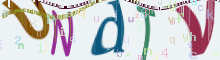

###  样式



### composer
```php
composer require "lshorz/laravel-captcha": "dev-master"
```

### 扩展发布
```php
php artisan vendor:public --provider=Lshorz\LaravelCaptcha\CaptchaServiceProvider --tag=config
```

### 配置
可参考 config/captcha.php
```php
return [
    'default' => [
        'name' => 'captcha', //  默认session name
        'length' => 5,   //验证码长度
        'width' => 160,   //图像宽度
        'height' => 50,   //图像高度
        'quality' => 90,   //图像质量
        'noise' => 60,     //噪点数量
        'angle' => 1,      //字体角度(0:则随机角度)
        'distort' => true, //开启图像扭曲度
        'distortType' => 2, //图像扭曲算法
        'distortScale' => 2.0, //图像扭曲度(仅distortType=1有效)
        'lines' => 0,     //干扰线数量(0:则不生成)
        'lineThickness' => mt_rand(1, 3), //干扰线粗细
        //...
    ],
    'number' => [
        'name' => 'number',      //session name
        'length' => mt_rand(4, 5),
        'width' => 120,
        'height' => 40,
        'characters' => '23456789',
        'lines' => mt_rand(1, 3),     //干扰线数量(0:则不生成)
        'lineThickness' => mt_rand(1, 3),
        'distortType' => 1, //图像扭曲算法
        'distortScale' => 2.0, //图像扭曲度(仅distortType=1有效)
    ],
]
```

### 使用例子
```
<form action="/checkCaptcha" method="post">
    
    <input type="text" name="code">
    <button type="submit">submit</button>
</form>
```

```php
public function check(Request $request)
{
    // 验证函数第二个参数为true,则验证后即清除session
    // 如果在配置中有指定session name则第三个参数必须填写
    dump(captcha_check($request->get('code'), true, 'number'));
}
```

or

```php
public function ajaxCheck(Request $request)
{
    $code = $request->get('code');
    //  验证函数第二个参数为false,则验证后不清除session，可用于支持ajax验证，最终提交后再清除session
    $check = Captcha::check($request->get('code'), false, 'number');
    $data = [
        'code' => $code,
        'v' => $check
    ];
    return response()->json($data);
}
```
or

```php
public function check(Request $request)
{
    $this->validate($request, [
        'title' => 'required|captcha:true,number',
    ]);
}
```